# 📚 SchoolTalkz — Communication & Analytics Hub for Educational Institutions

> **Note:** This repository contains **partial code**. This README documents the **full system** (architecture, data flow, design decisions) and includes **pseudocode** so reviewers can understand the complete implementation.

---

<p align="center">
  <a href="#overview">Overview</a> •
  <a href="#features">Features</a> •
  <a href="#architecture">Architecture</a> •
  <a href="#data--etl-pipeline">Data & ETL</a> •
  <a href="#analytics--ml">Analytics & ML</a> •
  <a href="#database-design--optimizations">DB Design</a> •
  <a href="#api-surface">API</a> •
  <a href="#roadmap">Roadmap</a>
</p>

---

## Overview

**SchoolTalkz** is a **full-stack communication and engagement analytics platform** for schools and colleges. It centralizes announcements, discussions, and insights across multiple institutions, enabling faster updates, structured reporting, and **data-driven engagement analysis**.

- **ReactJS** SPA (responsive, role-based views)
- **Node.js REST API** over **PostgreSQL** (indexed, partitioned)
- **Apache Airflow** ETL (data prep, archival to **AWS S3**, analytics refresh)
- **Descriptive & Predictive analytics** (trends, participation forecasting)
- **Containerized & cloud-ready** deployment

> **Impact highlights**
> - ~**40% faster** analytics/report generation via **indexing, partitioning, materialized views**
> - Automated **ETL with retries & alerts** for reliability
> - **Model-ready datasets** for engagement predictions & insights

---

## Features

- **Multi-institution messaging & announcements**
- **Role-aware access** (student / teacher / admin)
- **Real-time feed** (WebSockets/SSE) + **batch analytics**
- **Automated archival** to S3 and **MV refresh** in Postgres
- **Engagement insights** (daily/weekly trends, unique authors, topic activity)
- **Predictive models** to flag low-engagement topics / forecast participation

---

## Architecture

### 1) System Map (High-Level)

```mermaid
flowchart LR
  subgraph Clients
    U1[Student Browser]
    U2[Teacher/Admin Browser]
  end

  subgraph Frontend [ReactJS SPA]
    FE[Role-based UI\nAnnouncements • Chat • Analytics]
  end

  subgraph Backend [Node.js REST API]
    API[Auth + Validation + RBAC\nCRUD Endpoints]
    DB[(PostgreSQL)]
  end

  subgraph DataPlatform [Data & Analytics]
    AF[Apache Airflow DAGs\nExtract • Transform • Load]
    S3[(AWS S3\nRaw & Clean Archives)]
    MV[(Materialized Views\nDaily Aggregates)]
    ML[(Analytics & Prediction Engine)]
  end

  subgraph AdminViews [Dashboards]
    REP[Admin Reports\nTrends • Forecasts]
  end

  U1 -->|HTTPS| FE
  U2 -->|HTTPS| FE
  FE -->|REST| API
  API --> DB
  DB <--> MV
  AF -->|Extract| DB
  AF -->|Archive| S3
  AF -->|Refresh| MV
  AF -->|Batch Features| ML
  ML --> REP
  FE --> REP
```



### 2) Request Lifecycle (Post Announcement)


### 3) Data State Progression


---

## Data & ETL Pipeline

**Goals:** reliable extraction, normalization, archival, aggregate refresh, model prep & inference.

```python
# airflow/dags/schooltalkz_pipeline.py  (pseudocode)
from airflow import DAG
from airflow.operators.python import PythonOperator
from datetime import datetime, timedelta

def extract_from_postgres(**ctx):
    # Pull new/changed rows since last watermark
    pass

def clean_and_vectorize(**ctx):
    # Normalize text, tokenize, build features; validate with Great Expectations
    pass

def run_engagement_model(**ctx):
    # Batch inference (and scheduled retrain); persist predictions
    pass

def refresh_materialized_views(**ctx):
    # REFRESH MATERIALIZED VIEW CONCURRENTLY mv_daily_school_engagement
    pass

def archive_to_s3(**ctx):
    # Upload raw & cleaned snapshots to S3 by date-partitioned keys
    pass

default_args = {"owner": "schooltalkz", "retries": 3, "retry_delay": timedelta(minutes=10)}

with DAG(
    dag_id="schooltalkz_pipeline",
    start_date=datetime(2024,1,1),
    schedule_interval="@daily",
    catchup=False,
    default_args=default_args,
    max_active_runs=1
) as dag:
    extract = PythonOperator(task_id="extract", python_callable=extract_from_postgres)
    transform = PythonOperator(task_id="transform", python_callable=clean_and_vectorize)
    predict  = PythonOperator(task_id="predict",  python_callable=run_engagement_model)
    refresh  = PythonOperator(task_id="refresh_mv", python_callable=refresh_materialized_views)
    archive  = PythonOperator(task_id="archive",  python_callable=archive_to_s3)

    extract >> transform >> predict >> refresh >> archive
```

**Operational Hardening**
- **Retries & alerts** (email/Slack)
- **Schema/data quality checks** (e.g., Great Expectations)
- **Idempotent** loads + **watermarking** to avoid duplicates
- **Partitioned S3 layout** for lifecycle policies & cost control

---

## Analytics & ML

**Descriptive analytics**
- Daily/weekly engagement, unique authors, topic activity, response latencies

**Predictive analytics**
- Classify/forecast **engagement level** per announcement/topic
- Identify **low-engagement** items for intervention

```python
# analytics/engagement_model.py  (pseudocode)
from sklearn.feature_extraction.text import TfidfVectorizer
from sklearn.linear_model import LogisticRegression
from sklearn.pipeline import Pipeline

pipeline = Pipeline([
  ("tfidf", TfidfVectorizer(max_features=20000, ngram_range=(1,2))),
  ("clf", LogisticRegression(max_iter=1000))
])

pipeline.fit(X_text_train, y_train)
preds = pipeline.predict(X_text_val)
```

**Feature engineering (examples)**
- Text: lowercasing, punctuation stripping, stopword removal, TF-IDF, n-grams
- Context: time-of-day, day-of-week, author role, school segment, message length
- Targets: label by percentile thresholds of downstream engagement

**Serving**
- Batch inference in Airflow
- Optional **FastAPI** microservice for on-demand predictions
- Persist metrics & versions for auditability

---

## Database Design & Optimizations

```sql
-- 1) Indexing: recency filters + school scoping
CREATE INDEX idx_announcements_school_date
ON announcements (school_id, created_at DESC);

-- 2) Partitioning: parallelization & cheaper maintenance
CREATE TABLE announcements (
  id BIGSERIAL PRIMARY KEY,
  school_id INT NOT NULL,
  author_id INT NOT NULL,
  message TEXT NOT NULL,
  created_at TIMESTAMP NOT NULL DEFAULT NOW()
) PARTITION BY LIST (school_id);

-- Example partition (repeat per school)
CREATE TABLE announcements_s1 PARTITION OF announcements FOR VALUES IN (1);

-- 3) Materialized view: daily aggregates for reports
CREATE MATERIALIZED VIEW mv_daily_school_engagement AS
SELECT
  school_id,
  date_trunc('day', created_at) AS day,
  COUNT(*) AS messages,
  COUNT(DISTINCT author_id) AS unique_authors
FROM announcements
GROUP BY 1,2;

-- 4) Fast refresh (triggered by Airflow)
REFRESH MATERIALIZED VIEW CONCURRENTLY mv_daily_school_engagement;
```

> **Result:** ~**40% reduction** in report generation time via indexing, partitioning, and MV refresh.

---

## API Surface

```http
# Announcements (with optional analytics fields)
GET /api/schools/:schoolId/announcements?withAnalytics=true

# Create announcement
POST /api/schools/:schoolId/announcements
Content-Type: application/json
{
  "authorId": 101,
  "message": "Exam schedule released",
  "tags": ["exams", "grade10"]
}

# Aggregated engagement for dashboards
GET /api/admin/:schoolId/engagement?range=7d
```

**Notes**
- JWT auth, RBAC at route/method level
- Validation & rate limiting for stability

---

## Roadmap

- Semantic text analysis (summaries, topic clustering)
- Real-time model serving for on-the-fly scoring
- Mobile-first PWA & offline sync
- Data catalog & metadata lineage

---

## License

**Mixed / proprietary** (contact for details).  
Parts of the implementation and datasets are **not public** due to confidentiality. This README functions as the **technical overview** of the complete system.
